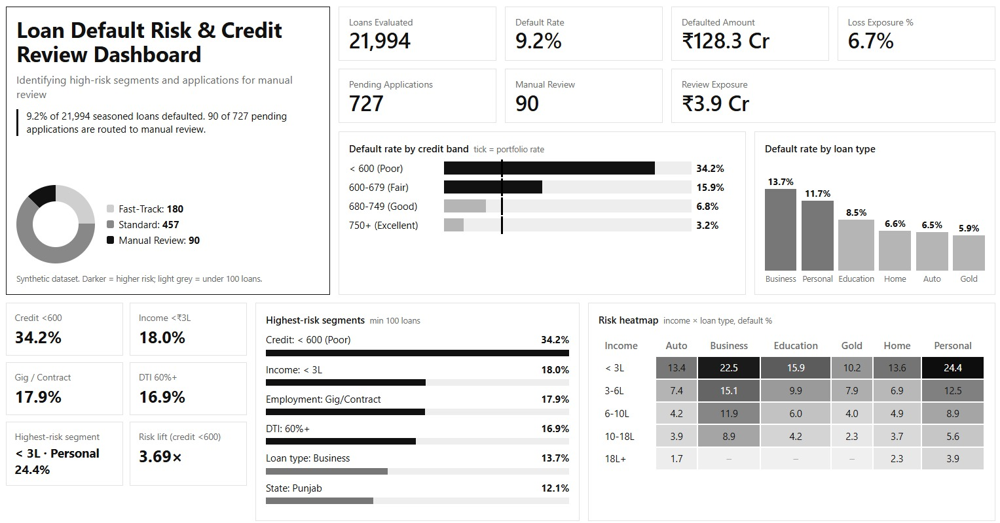

# Loan Default Risk Dashboard

> **Which borrower segments have the highest default risk, and which pending applications should the credit team review first?**



**Domain:** BFSI — Banking, Financial Services & Insurance
**Tools:** SQL, Power BI, DAX, Python
**Database:** SQLite
**Dataset:** Synthetic lending data

> **Note:** The dataset is synthetic. The results demonstrate the analytical approach and dashboard methodology, not real-world lending performance.

---

## 📌 Business Problem

Credit teams need to identify **high-risk borrower segments** and prioritize applications that require additional manual review.

This project analyzes historical loan outcomes to answer two business questions:

1. Which customer segments have the highest loan default probability?
2. Which pending applications should the credit team manually review first?

The analysis focuses on:

* Credit score
* Income bracket
* Loan type
* Employment history
* Debt-to-income ratio
* Previous delinquencies
* Geography

---

## 📊 Project Overview

The project builds a complete credit-risk analytics pipeline:

1. Generates a relational lending dataset containing **20,000 customers and 24,000 loans**.
2. Uses SQL for data quality checks, feature engineering and segmentation.
3. Calculates historical default rates across important borrower segments.
4. Applies a seasoning rule so loans without enough time to observe an outcome are excluded.
5. Estimates segment-level probability of default using smoothed historical default rates.
6. Identifies risk flags for pending applications.
7. Routes applications into:

   * 🔴 **Manual Review**
   * 🟡 **Standard**
   * 🟢 **Fast-Track**
8. Visualizes the results in Power BI.

---

## 🔍 Key Findings

Based on **21,994 loans with a known outcome**, the portfolio default rate is approximately **9.2%**.

### Credit Score

Borrowers with credit scores below 600 represent only around **4% of loans but 15% of defaults**.

Their default rate is approximately **34.2%**, around **3.7× the portfolio default rate**.

### Income

| Income Segment | Default Rate |
| -------------- | -----------: |
| Under ₹3L      |    **18.0%** |
| Above ₹18L     |     **2.5%** |

Lower-income borrowers show substantially higher historical default rates.

### Employment

| Employment Type | Default Rate |
| --------------- | -----------: |
| Gig / Contract  |    **17.9%** |
| Government      |     **5.1%** |

Employment stability is therefore an important risk segmentation factor.

### Debt-to-Income Ratio

Default probability increases as borrower leverage increases:

| DTI Band  | Default Rate |
| --------- | -----------: |
| Under 30% |     **6.3%** |
| Above 60% |    **16.9%** |

### Highest-Risk Segment

The riskiest observed segment was approximately:

> **Personal loans + income below ₹3L**

with a default rate of around **24%**.

### Manual Review Queue

There were **727 pending applications**.

Of these:

* **90 applications (12%)** were routed to Manual Review.
* Manual Review applications had an average segment default rate of **16.7%**.
* Fast-Track applications had an average segment default rate of **5.3%**.

This demonstrates how the routing logic can help credit teams prioritize higher-risk applications instead of manually reviewing every pending application.

---

## 🧠 Risk Methodology

### 1. Default Rate

Default rate is calculated as:

```text
Default Rate =
Defaulted Loans / Loans With Known Outcome
```

Pending loans and loans that have not completed the minimum seasoning period are excluded.

---

### 2. Seasoning Rule

Only loans that are at least **6 months old** are considered eligible for historical outcome analysis.

This prevents recent loans from being incorrectly treated as non-defaults simply because they have not had enough time to mature.

---

### 3. Segment Risk

Historical default rates are calculated across combinations of:

* Income bracket
* Loan type
* Employment type
* Credit band
* DTI band
* Geography

Small segments are excluded from the dashboard when there are fewer than **100 loans**, reducing the impact of unstable small-sample rates.

---

### 4. Segment Probability of Default

For borrower segments with sufficient historical data, the observed default rate is smoothed toward the overall portfolio default rate.

This prevents very small groups from producing misleadingly high or low risk estimates.

---

### 5. Risk Flags

Pending applications are evaluated using several red flags:

```text
Credit Score < 620
DTI >= 55%
2+ Previous Delinquencies
Employment History < 2 Years
```

---

### 6. Application Routing

Applications are classified into three operational categories:

| Route            | Purpose                                             |
| ---------------- | --------------------------------------------------- |
| 🔴 Manual Review | Higher-risk applications requiring human assessment |
| 🟡 Standard      | Applications requiring normal credit processing     |
| 🟢 Fast-Track    | Lower-risk applications with no major risk flags    |

Manual Review is triggered by combinations of high segment risk and borrower-level risk flags.

---

## 📈 Power BI Dashboard

The dashboard provides a credit-risk view of the portfolio with:

* Portfolio default rate
* Defaulted amount
* Loss exposure
* Loans evaluated
* Pending applications
* Default rate by credit band
* Default rate by loan type
* Income × loan type risk heatmap
* High-risk borrower segments
* Manual Review queue
* Filters for:

  * Loan Type
  * State
  * Income Bracket
  * Employment Type

The dashboard is designed to answer both:

> **"Where is portfolio risk concentrated?"**

and

> **"Which applications need attention?"**

---

## 🗂️ Repository Structure

```text
loan-default-risk-dashboard/
│
├── data/
│   ├── customers.csv
│   └── loans.csv
│
├── sql/
│   ├── 01_schema.sql
│   ├── 02_data_quality_and_features.sql
│   ├── 03_segment_analysis.sql
│   └── 04_review_queue.sql
│
├── scripts/
│   ├── 01_generate_data.py
│   └── 02_build_db_and_export.py
│
├── output/
│   ├── loan_risk.db
│   ├── fact_loans.csv
│   ├── segment_default_rates.csv
│   └── review_queue.csv
│
├── powerbi/
│   ├── 01_DAX_measures.md
│   ├── 02_dashboard_blueprint.md
│   └── theme.json
│
├── docs/
│   ├── FINDINGS.md
│   └── screenshots/
│       └── dashboard.png
│
└── README.md
```

---

## ⚙️ How to Run

### 1. Clone the repository

```bash
git clone https://github.com/YOUR_USERNAME/loan-default-risk-dashboard.git
cd loan-default-risk-dashboard
```

### 2. Install Python dependencies

```bash
pip install pandas numpy
```

### 3. Generate the synthetic dataset

```bash
python scripts/01_generate_data.py
```

### 4. Build the SQLite database and export analysis tables

```bash
python scripts/02_build_db_and_export.py
```

This creates the SQLite database, executes the SQL pipeline and generates the CSV files used by Power BI.

### 5. Open Power BI

Open **Power BI Desktop** and import the generated CSV files from the `output/` folder.

Follow:

```text
powerbi/02_dashboard_blueprint.md
```

for the dashboard structure and DAX measures.

---

## 🛠️ Tech Stack

| Technology       | Purpose                                                    |
| ---------------- | ---------------------------------------------------------- |
| **Python**       | Synthetic data generation and pipeline execution           |
| **SQL / SQLite** | Data cleaning, transformation, segmentation and risk logic |
| **Power BI**     | Interactive dashboard and visualization                    |
| **DAX**          | KPIs and analytical measures                               |
| **Git / GitHub** | Version control and project sharing                        |

---

## ⚠️ Limitations

This project is designed as a **credit-risk analytics demonstration**, not a production lending model.

Key limitations:

* Dataset is synthetic.
* Segment probability of default is based on historical rates rather than a trained ML model.
* No rejected-application data is available.
* Loss exposure assumes full loss on default and does not model recoveries.
* Recent loans may have incomplete outcome history.
* Segment-level risk is descriptive and should not be interpreted as a calibrated predictive model.

---

## 🚀 Future Improvements

Potential next steps include:

* Train a **Logistic Regression / XGBoost** default prediction model.
* Compare ML predictions against the rule-based routing system.
* Add expected-loss calculations:

```text
Expected Loss =
Probability of Default × Exposure at Default × Loss Given Default
```

* Add cost-benefit analysis for manual reviews.
* Incorporate rejected applications to analyze approval bias.
* Add model performance metrics such as:

  * ROC-AUC
  * Precision
  * Recall
  * F1 Score
  * Confusion Matrix
* Publish the Power BI report to Power BI Service.

---

## 👨‍💻 Project Focus

This project demonstrates practical skills in:

**SQL → Data Quality → Feature Engineering → Risk Segmentation → Business Rules → DAX → Power BI → Business Insights**

The goal is not simply to visualize loan data, but to convert historical lending data into **actionable credit-risk decisions**.
